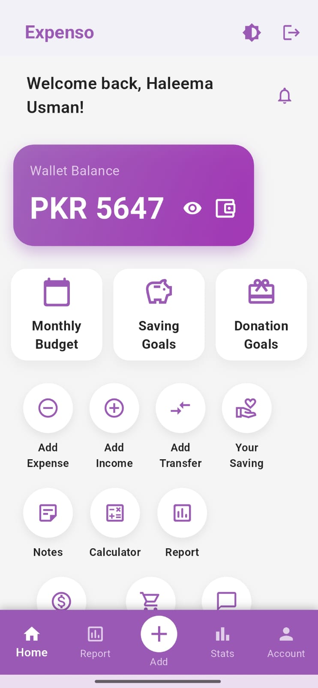
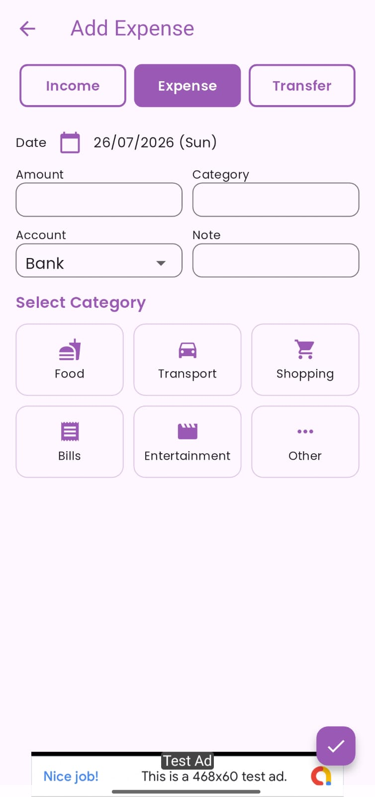
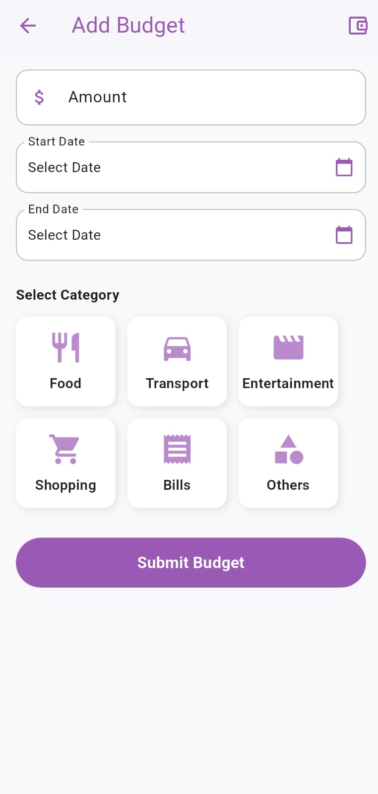
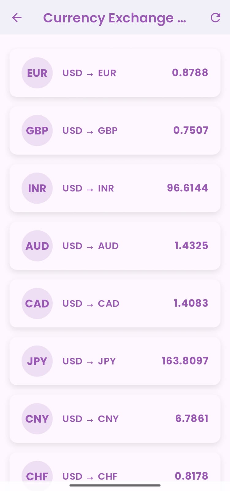
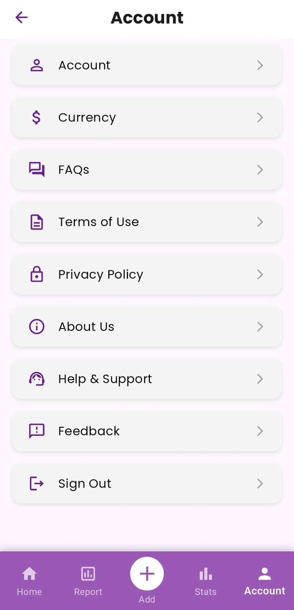

<p align="center">
  
</p>

<h1 align="center">Expenso</h1>

<p align="center">
A modern personal finance management application built with Flutter and Firebase.
</p>

<p align="center">
Manage your income, expenses, budgets, savings, donations, and financial insights through an intuitive and feature-rich experience.
</p>

<p align="center">
  <a href="https://expenso-app.vercel.app/">Live Demo</a> •
  <a href="https://github.com/Jawaria-coder/Expenso/releases/download/v1.0/Expenso_v1.0.apk">Download APK</a>
</p>

---

# Overview

Expenso is a cross-platform personal finance management application developed using **Flutter** and **Firebase**.

The application enables users to efficiently monitor their income, expenses, budgets, savings, and donations while providing financial insights through an interactive dashboard.

Expenso also includes authentication, shopping lists, notes with voice recording, PDF report generation, live currency exchange rates, and multiple personalization options to simplify day-to-day financial management.

---

# Features

## Authentication

- Email & Password Authentication
- Google Sign-In
- Password Recovery
- User Verification

## Finance Management

- Wallet Balance
- Add Income
- Add Expenses
- Transaction History
- Money Transfers
- Expense Categories

## Budget & Goals

- Monthly Budgets
- Budget Overview
- Saving Goals
- Donation Goals

## Productivity

- Shopping Lists
- Notes with Voice Recording
- Built-in Calculator

## Financial Insights

- Financial Statistics
- PDF Report Generation
- Live Currency Exchange Rates

## Personalization

- Dark Mode
- Multi-Currency Support
- Notifications
- Account Management
- Feedback & Support
- Privacy Policy
- Terms of Use

---

# Screenshots

## Secure Login

<p align="center">

</p>

---

## Financial Dashboard

<p align="center">

</p>

---

## Expense Management

<p align="center">

</p>

---

## Monthly Budget Planner

<p align="center">

</p>

---

## Live Currency Exchange Rates

<p align="center">

</p>

---

## Application Settings

<p align="center">

</p>

---

# Project Structure

```text
Expenso
│
├── Expenso-App
│   ├── android
│   ├── ios
│   ├── lib
│   │   ├── models
│   │   ├── services
│   │   ├── main.dart
│   │   └── ...
│   ├── assets
│   ├── web
│   ├── windows
│   ├── linux
│   ├── macos
│   └── pubspec.yaml
│
├── screenshots
│   ├── login.jpeg
│   ├── dashboard.jpeg
│   ├── expense.jpeg
│   ├── budget.jpeg
│   ├── currency_rates.jpeg
│   └── settings.jpeg
│
├── Expenso-download
│
└── README.md
```

---

# Getting Started

## Clone the Repository

```bash
git clone https://github.com/haleemausman1/Expenso.git
```

## Navigate to the Flutter Project

```bash
cd Expenso/Expenso-App
```

## Install Dependencies

```bash
flutter pub get
```

## Run the Application

```bash
flutter run
```

---

# Supported Platforms

- Android
- iOS
- Web
- Windows
- macOS
- Linux

---

# Future Improvements

- AI-powered spending insights
- Investment tracking
- Recurring transactions
- Bill reminders
- Advanced financial analytics
- Cloud backup enhancements

---

# License

This project is open-source and available for educational and personal use.

---

# Author

**Haleema Usman**

Flutter Developer | Firebase | Mobile Application Development